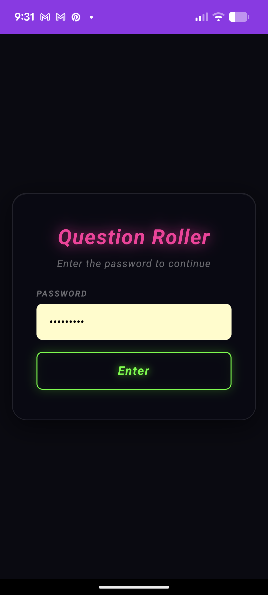
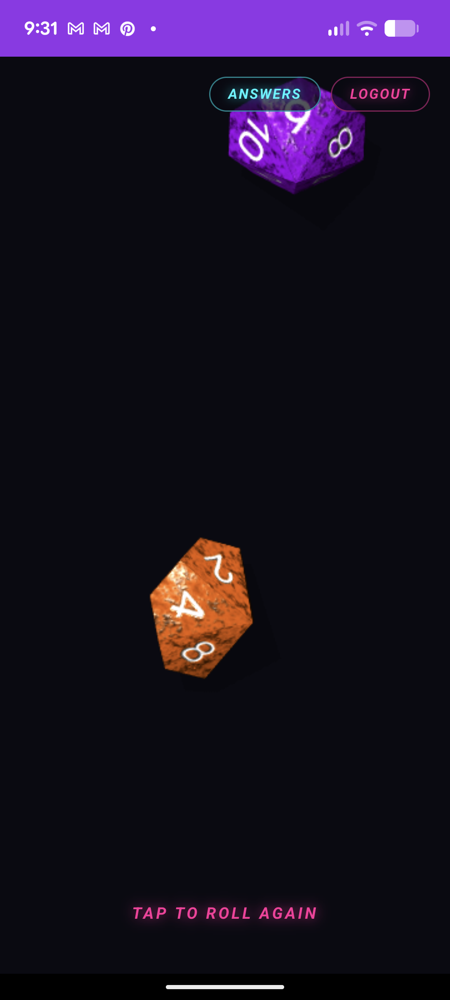
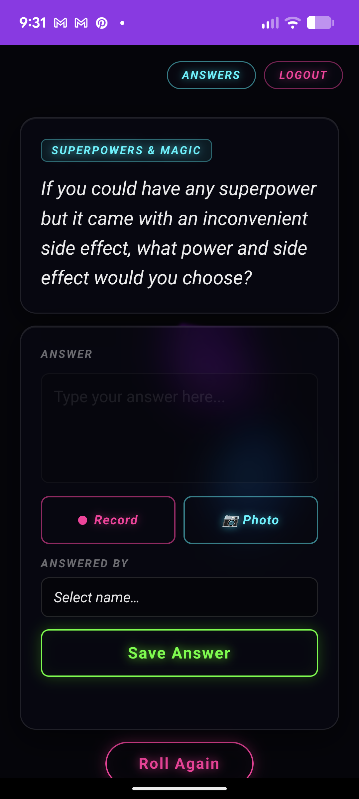
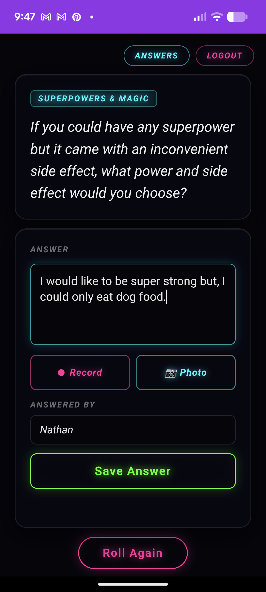
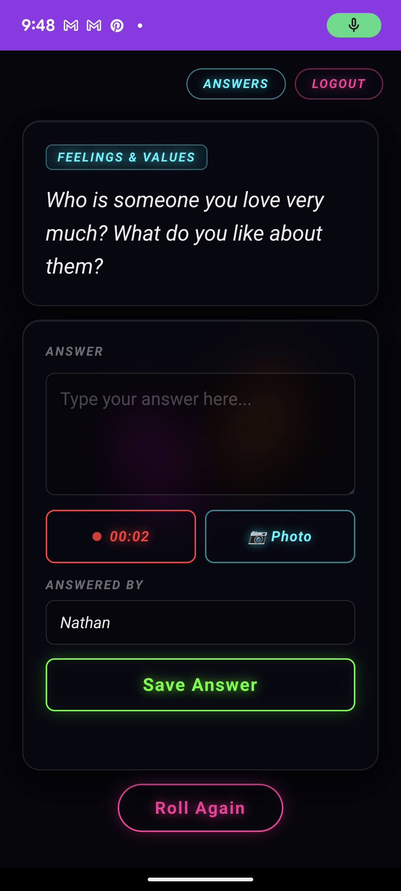
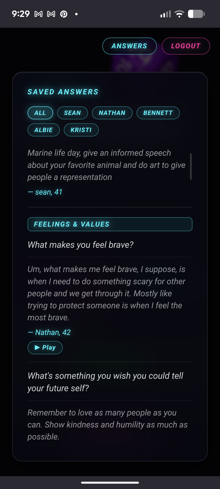

# Question Roller

> **Vibe coded** — This app was built entirely with AI assistance (Claude Code). No traditional development process was harmed in the making of this project.

A family web app that rolls 3D physics dice to randomly select a question from a pool of 1,000+ questions. Family members record their answers as text, audio recordings, and photos — all stored server-side and browsable any time. Questions can be read aloud via text-to-speech, and voice answers are automatically transcribed.

| | | |
|:---:|:---:|:---:|
|  |  |  |
| *Login* | *Roll the dice* | *Question appears* |
|  |  |  |
| *Record your answer* | *Voice recording* | *Browse all answers* |

---

## Features

- **3D dice roll** — Babylon.js + Ammo.js WebAssembly physics via [@3d-dice/dice-box](https://github.com/3d-dice/dice-box)
- **1,035 questions** across multiple categories
- **Per-member answers** — select or create a family member before answering
- **Age tracking** — stores each member's date of birth; automatically records how old they were when they answered
- **Auto-read questions** — questions are read aloud automatically when they appear; 🔊 button toggles auto-read on/off for the session
- **Audio recording** — record voice answers directly in the browser; automatically transcribed via Whisper
- **Photo capture** — take or upload photos, compressed client-side before upload
- **Chunked uploads** — safe for large recordings behind Cloudflare or other proxies (1 MB chunks)
- **Answers panel** — browse all answers, filterable by author, grouped by category; each question has 🔊 (read aloud) and ✏ (open to add/edit) buttons
- **Multiple answers per person** — save a second or third answer over the years; prompted to Replace or Add when a duplicate is detected
- **Installable PWA** — works as a home screen app on iOS and Android
- **Session auth** — single password protects all data
- **Security hardened** — helmet headers, rate limiting, input validation, mimeType whitelist, file size caps

---

## Requirements

- [Docker](https://docs.docker.com/get-docker/) + Docker Compose
- *(Optional, but bundled)* An NVIDIA GPU for the [speaches](https://github.com/speaches-ai/speaches) STT+TTS container

---

## Quick Start

### 1. Create your compose file

Create a `docker-compose.yml`:

```yaml
services:
  web:
    image: sweetmeats83/question-roller:latest
    ports:
      - "8180:3000"
    env_file: .env
    volumes:
      - ${ANSWERS_PATH:-./data}:/data
    depends_on:
      - speaches
    restart: unless-stopped

  speaches:
    image: ghcr.io/speaches-ai/speaches:latest-cuda-12.6.3
    ports:
      - "8082:8000"
    volumes:
      - /path/to/models/cache:/home/ubuntu/.cache/huggingface/hub
    restart: unless-stopped
    healthcheck:
      test: ["CMD-SHELL", "curl -sf http://localhost:8000/ || exit 1"]
      interval: 5s
      timeout: 3s
      retries: 20
      start_period: 15s
    deploy:
      resources:
        reservations:
          devices:
            - driver: nvidia
              count: all
              capabilities: [gpu]

  speaches-init:
    image: curlimages/curl:latest
    depends_on:
      speaches:
        condition: service_healthy
    command: >
      sh -c "
        curl -sX POST http://speaches:8000/v1/models/Systran%2Ffaster-whisper-small &&
        curl -sX POST http://speaches:8000/v1/models/speaches-ai%2FKokoro-82M-v1.0-ONNX
      "
    restart: on-failure
```

### 2. Configure

Create a `.env` file:

```env
APP_PASSWORD=your-family-password
SESSION_SECRET=a-long-random-string-change-this
PUID=1000          # run: id -u  to find yours
PGID=1000          # run: id -g  to find yours
ANSWERS_PATH=/path/to/persistent/data/
WHISPER_URL=http://speaches:8000   # uses the bundled container
WHISPER_MODEL=Systran/faster-whisper-small
TTS_URL=http://speaches:8000       # uses the bundled container
TTS_MODEL=speaches-ai/Kokoro-82M-v1.0-ONNX
TTS_VOICE=af_heart                 # af_heart, af_bella, am_michael, am_adam, bf_emma, bm_george
```

### 3. Run

```bash
docker compose up -d
```

The app will be available at **http://localhost:8180**

### 4. First use

Navigate to the app, enter the password from your `.env`, and tap the screen to roll the dice.

---

## Environment Variables

| Variable | Default | Description |
|---|---|---|
| `APP_PASSWORD` | `changeme` | Password to log in to the app |
| `SESSION_SECRET` | `changeme-secret` | Secret key for signing session cookies. Use a long random string. |
| `PUID` | `1000` | User ID the container process runs as. Match your host user (`id -u`). |
| `PGID` | `1000` | Group ID the container process runs as. Match your host group (`id -g`). |
| `ANSWERS_PATH` | `./data` | Host path for persistent data (answers, members, media files) |
| `WHISPER_URL` | `http://speaches:8000` | URL of the Whisper STT server (OpenAI-compatible `/v1/audio/transcriptions`) |
| `WHISPER_MODEL` | `Systran/faster-whisper-small` | Whisper model ID. Larger models are more accurate but slower. |
| `TTS_URL` | `http://speaches:8000` | URL of the TTS server (OpenAI-compatible `/v1/audio/speech`) |
| `TTS_MODEL` | `speaches-ai/Kokoro-82M-v1.0-ONNX` | TTS model ID (HuggingFace model ID, not OpenAI name) |
| `TTS_VOICE` | `af_heart` | Kokoro voice. Options: `af_heart`, `af_bella`, `am_michael`, `am_adam`, `bf_emma`, `bm_george` |

---

## Data Storage

All persistent data lives in the directory set by `ANSWERS_PATH`:

```
data/
├── answers.json      # all saved answers, keyed by question ID
├── members.json      # family members with name and date of birth
├── media/            # uploaded audio recordings and photos
└── tmp/              # temporary chunk assembly (auto-cleared on startup)
```

The container mounts this directory as `/data` inside the container, running as `PUID:PGID` to match your host filesystem permissions.

---

## Speech (STT + TTS)

The bundled `docker-compose.yml` includes a [speaches](https://github.com/speaches-ai/speaches) container that handles both:

- **Speech-to-text** — voice recordings are transcribed automatically after upload using `faster-whisper-small`
- **Text-to-speech** — questions are read aloud automatically when they appear (Kokoro TTS); the 🔊 button on the question card toggles auto-read on/off for the session. Questions in the answers panel also have individual 🔊 buttons.

Speaches runs on port `8082` and is reachable by the `web` container over the internal Docker network as `http://speaches:8000`. The `speaches-init` container registers both models on every startup via the API.

### First-time model download

Models are downloaded from HuggingFace on first use and cached to the host path mounted in `docker-compose.yml`. Before the first run, ensure the cache directory is writable by the speaches user (uid 1000):

```bash
chown -R 1000:1000 /path/to/your/models/cache
```

Then bring the stack up — `speaches-init` will trigger both downloads automatically:

```bash
docker compose up -d
```

You can also trigger downloads manually:

```bash
curl -X POST "http://localhost:8082/v1/models/Systran%2Ffaster-whisper-small"
curl -X POST "http://localhost:8082/v1/models/speaches-ai%2FKokoro-82M-v1.0-ONNX"
```

### GPU requirement

The bundled speaches image (`latest-cuda-12.6.3`) requires an NVIDIA GPU with the [NVIDIA Container Toolkit](https://docs.nvidia.com/datacenter/cloud-native/container-toolkit/install-guide.html). If you don't have a GPU, switch to a CPU image or point `WHISPER_URL`/`TTS_URL` at an external server.

### Graceful degradation

If speaches is unreachable or transcription fails, audio is still saved — the transcription just won't auto-fill the answer text. If TTS fails, the 🔊 button silently does nothing.

---

## Installing as a Mobile App (PWA)

The app is a Progressive Web App and can be installed directly to your phone's home screen.

| | |
|:---:|:---:|
|  |  |
| *Share → Add to Home Screen (iOS)* | *Installed on home screen* |

**Android (Chrome):**
1. Open the app in Chrome
2. Tap the three-dot menu → **Add to Home Screen**
3. Chrome may also show an automatic install banner after a few visits

**iPhone (Safari):**
1. Open the app in Safari
2. Tap the **Share** button (box with arrow)
3. Scroll down and tap **Add to Home Screen**

Once installed, the app launches fullscreen without browser chrome, just like a native app.

> Requires HTTPS. If accessing over a local domain, you'll need a valid SSL certificate (e.g., via a reverse proxy like nginx with Let's Encrypt).

---

## Project Structure

```
questions/
├── app/                    # Static frontend (copied into Docker image)
│   ├── index.html          # Main app shell
│   ├── login.html          # Login page
│   ├── login.css           # Login page styles
│   ├── login.js            # Login form logic
│   ├── styles.css          # Main app styles
│   ├── app.js              # Main frontend ES module
│   ├── questions.json      # Question pool (1,035 questions)
│   ├── manifest.json       # PWA manifest
│   ├── service-worker.js   # PWA service worker (network-first)
│   ├── favicon.svg         # Browser tab icon
│   ├── icon.svg            # PWA home screen icon
│   └── icon-maskable.svg   # PWA maskable icon (Android adaptive)
├── server.js               # Express server (API + static serving)
├── entrypoint.sh           # Docker entrypoint (sets up PUID/PGID)
├── Dockerfile
├── docker-compose.yml
├── package.json
├── .env.example            # Environment variable template
└── .dockerignore
```

---

## API Reference

All endpoints except login/logout require a valid session cookie.

| Method | Path | Description |
|---|---|---|
| `POST` | `/api/login` | Authenticate with password |
| `POST` | `/api/logout` | End session |
| `GET` | `/api/session` | Check if session is active |
| `GET` | `/api/members` | List all family members |
| `POST` | `/api/members` | Add or update a member `{ name, dob }` |
| `GET` | `/api/answers` | Get all answers (all questions) |
| `GET` | `/api/answers/:id` | Get answers for one question |
| `POST` | `/api/answers/:id` | Save an answer `{ answer, author, audio?, photos?, forceNew? }` — `forceNew: true` adds alongside existing answers; default replaces |
| `DELETE` | `/api/answers/:id` | Delete all answers for a question |
| `POST` | `/api/upload/chunk` | Upload a file chunk (multipart) |
| `GET` | `/api/speak?text=...` | Proxy TTS request to speaches; streams back MP3 audio |
| `GET` | `/media/:filename` | Serve a media file |

---

## Security

- **Session auth** with `httpOnly`, `sameSite: lax` cookies (7-day expiry)
- **Timing-safe** password comparison (`crypto.timingSafeEqual`)
- **Rate limiting** — 10 login attempts per 15 min; 120 API requests per min
- **HTTP security headers** via [helmet](https://helmetjs.github.io/) (CSP, X-Frame-Options, HSTS, etc.)
- **Input validation** — question IDs, author names (80 char max), answer text (10,000 char max), mimeType whitelist, media path regex
- **Chunked upload limits** — 100 MB max assembled file, 200 max chunks, 2 MB per chunk
- **Whisper timeout** — 60 second max for transcription requests
- **Path traversal protection** — `path.basename()` on all user-supplied filenames

---

## Clearing Data

To start fresh (wipe all answers and members):

```bash
docker compose exec web sh -c "rm -f /data/answers.json /data/members.json"
```

To also remove all uploaded media:

```bash
docker compose exec web sh -c "rm -rf /data/media/* /data/answers.json /data/members.json"
```

---

## Updating

To pull the latest image:

```bash
docker compose pull
docker compose up -d
```

---

## Adding Questions

Questions are baked into the image. To add your own, clone the repo, edit `app/questions.json`, rebuild, and push your own image:

```bash
git clone <your-repo-url>
cd questions
# edit app/questions.json
docker build -t your-username/question-roller:latest .
docker push your-username/question-roller:latest
```

Each entry requires:

```json
{
  "id": 1036,
  "category": "Childhood",
  "question": "What is your earliest memory?"
}
```

IDs must be unique.

---

## Credits

- **[dice-box](https://github.com/3d-dice/dice-box)** by [3d-dice](https://github.com/3d-dice) — 3D physics dice rendering (MIT License)
- **[theme-rust](https://github.com/3d-dice/theme-rust)** by [3d-dice](https://github.com/3d-dice) — rust dice theme (MIT License)
- **[speaches](https://github.com/speaches-ai/speaches)** by speaches-ai — OpenAI-compatible STT (faster-whisper) + TTS (Kokoro) server (MIT License)
- **[Kokoro-82M](https://huggingface.co/speaches-ai/Kokoro-82M-v1.0-ONNX)** by speaches-ai — fast, high-quality English TTS model
